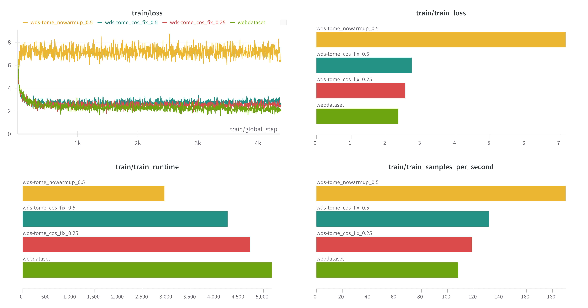

# LLaVA-scale

`Codebase to scale-up LLaVA.`

## 🎯 Potential Issues for Scale-up

### \# 1-1. Data Scale-up

> The current data pipeline assumes all images (videos) and their corresponding metadata to be stored locally. However, this will become easily infeasible when the dataset is scaled. Plus, there are more elegant ways to implement *lazy dataloading* without explicitly defining custom dataloading pipeline as in the original code base.

### \# 1-2. Model Scale-up

> LLaVA is essentially made up of three architectural components: vision encoder, projector and the language model. In most (if not all) model variants, the language model with a huge number of parameters (7B~) takes up most of the compute resources. Therefore, to control compute resources with model scale-up, we need to pay careful attention to the number of tokens being computed by the language model. Current implementation takes little care of this, hence with higher spatial/temporal resolution input, the compute for the language model will become very expensive.

### \# 1-3. Team Scale-up

> The code itself is overall well-written, but when more people are to contribute to this codebase, we need to make some parts more modular, especially the `train.py`. This file alone contains code for argument parsing, model configuration, dataset classs definition, data preprocessing, and the actual training, which could be refactored to enhance readability and reusability.

## 🎯 Proposed Modifications

### \# 2-1. Webdataset

[Webdataset](https://webdataset.github.io/webdataset/) is a pytorch implementation of [IterableDataset](https://pytorch.org/docs/stable/data.html#torch.utils.data.IterableDataset) that provides efficient access to dataset stored in `.tar` archives in streaming fashion. It has advantages over classical map-based dataset in terms of scalability as it naturally supports `streaming` and `sharding`, relieving potential memory/communication bottlenecks.

Webdataset class is implemented in [webdataset.py](https://github.com/reyllama/LLaVA-scale/blob/main/llava/dataset/webdataset.py). Thanks to the flexible mapping supported by webdatasets, we can take care of the basic preprocessing of the audio-visual input using the `decode_sample()` method.

```python
    def decode_sample(self, sample):

        metadata = sample['json']
        conversations = metadata["conversations"]
        decoded_sample = dict()
        modal_list = list()

        if 'mp4' in sample:
            video = sample["mp4"]
            video = self.process_video(video) # 
            decoded_sample["video"] = video
            modal_list.append('VIDEO')

        if 'jpg' in sample:
            image = sample["jpg"]
            if self.data_args.image_aspect_ratio == 'pad':

                def expand2square(pil_img, background_color):
                    ...
                    return square_img
        
                image = expand2square(image, tuple(int(x * 255) for x in self.data_args.image_processor.image_mean))
                image = self.data_args.image_processor.preprocess(image, return_tensors='pt')['pixel_values'][0]

            else:
                image = self.data_args.image_processor.preprocess(image, return_tensors='pt')['pixel_values'][0]
            decoded_sample["image"] = image
            modal_list.append('IMAGE')

        if 'mp3' in sample:
            audio = sample["mp3"]
            audio = self.process_audio(audio)
            decoded_sample["audio"] = audio
            modal_list.append('AUDIO')

        decoded_sample['conversations'] = conversations
        decoded_sample['modal_list'] = modal_list

        return decoded_sample
```

Because we already have the 558k dataset locally, we convert them to `.tar` archive format to use webdataset pipeline. This code is provided in [convert_data_to_wds.py](https://github.com/reyllama/LLaVA-scale/blob/main/scripts/convert_data_to_wds.py).

```python
def create_sharded_tars_image(json_file, image_dir, output_dir, shard_size=1000):
    with open(json_file, 'r') as f:
        data = json.load(f)
    
    os.makedirs(output_dir, exist_ok=True)
    shard_idx = 0
    for i in range(0, len(data), shard_size):
        shard_data = data[i:i + shard_size]
        tar_path = os.path.join(output_dir, f"shard-{shard_idx:05d}.tar")
        with tarfile.open(tar_path, 'w') as tar:
            for item in shard_data:
                image_path = os.path.join(image_dir, item['image'])
                with open(image_path, 'rb') as img:
                    img_data = img.read()
                img_name = os.path.basename(image_path)
                tarinfo = tarfile.TarInfo(name=f"{item['id']}.jpg")
                tarinfo.size = len(img_data)
                tar.addfile(tarinfo, io.BytesIO(img_data))
                meta_data = {
                    'id': item['id'],
                    'conversations': item['conversations']
                }
                meta_str = json.dumps(meta_data)
                tarinfo = tarfile.TarInfo(name=f"{item['id']}.json")
                tarinfo.size = len(meta_str)
                tar.addfile(tarinfo, io.BytesIO(meta_str.encode('utf-8')))
        shard_idx += 1
        if shard_idx % 10 == 0:
            print(f"{shard_idx} / {len(data) // shard_size} completed.")
```

The training logs for base (original) and webdataset pipeline are shown below.


### \# 2-2. Local Token Merging

[Token Merging](https://arxiv.org/abs/2210.09461) was originally proposed for classifier ViTs to improve the model throughput. However, as visual instruction following requires a much more fine-grained understanding of the visual content compared to fixed-label classification, we take inspirations from [Token Merging for Stable Diffusions](https://arxiv.org/abs/2303.17604) and make some modifications.

- ToMe-SD (Token Merging for SD) introduces a window-based anchor selection method (window size of 2x2) to adapt token merging to the dense prediction task (image generation).
- We modify ToMe-SD to preserve relative order of the visual tokens. Although the original ToMe-SD did not care so much about the sequence order (because older SDs do not embed position information anyways), for our task, the relative position order of visual tokens is crucial.
- We introduce cosine scheduling for the token merging ratio `r` (proportion of tokens to merge). We observe training instability otherwise.

Following is the implementation of `LocalTokenMerging`. Full code can be found at [token_merging.py](https://github.com/reyllama/LLaVA-scale/blob/main/llava/model/token_merging.py).

```python
class LocalTokenMerging:
    def __init__(self, w: int, h: int, sx: int = 2, sy: int = 2, r: float = 0.5):
        self.w, self.h = w, h
        self.sx, self.sy = sx, sy
        self.r = 0.0
        self.max_r = r
        self.tik = 0.0

        if torch.distributed.get_rank() == 0:
            print(f"[ToMe] Initializing Local Token Merging with w: {w}, h: {h}, sx: {sx}, sy: {sy}, r: {r}")

    def adjust_r(self):
        self.r = self.max_r * (1 - math.cos((self.tik / 4000) * math.pi / 2)) if self.tik < 4000 else self.max_r
        
    def __call__(self, x: torch.Tensor):
        B, N, C = x.shape
        r = int(self.r * N)

        self.tik += 1
        self.adjust_r()

        if self.tik % 100 == 0:
            print(f"** ToMe info: self.r: {self.r}, self.max_r: {self.max_r}, self.tik: {self.tik}, N: {N}, r: {r}")

        if r <= 0:
            return x

        gather = mps_gather_workaround if x.device.type == "mps" else torch.gather

        with torch.no_grad():
            hsy, wsx = self.h // self.sy, self.w // self.sx

            rand_idx = torch.randint(self.sy*self.sx, size=(hsy, wsx, 1)).to(x.device)
            
            idx_buffer_view = torch.zeros(hsy, wsx, self.sy*self.sx, device=x.device, dtype=torch.int64)
            idx_buffer_view.scatter_(dim=2, index=rand_idx, src=-torch.ones_like(rand_idx, dtype=rand_idx.dtype))
            idx_buffer_view = idx_buffer_view.view(hsy, wsx, self.sy, self.sx).transpose(1, 2).reshape(hsy * self.sy, wsx * self.sx)

            if (hsy * self.sy) < self.h or (wsx * self.sx) < self.w:
                idx_buffer = torch.zeros(self.h, self.w, device=x.device, dtype=torch.int64)
                idx_buffer[:(hsy * self.sy), :(wsx * self.sx)] = idx_buffer_view
            else:
                idx_buffer = idx_buffer_view

            rand_idx = idx_buffer.reshape(1, -1, 1).argsort(dim=1)

            del idx_buffer, idx_buffer_view

            num_dst = hsy * wsx
            a_idx = rand_idx[:, num_dst:, :]
            b_idx = rand_idx[:, :num_dst, :]

            def split(x):
                C = x.shape[-1]
                src = gather(x, dim=1, index=a_idx.expand(B, N - num_dst, C))
                dst = gather(x, dim=1, index=b_idx.expand(B, num_dst, C))
                return src, dst

            metric = x / x.norm(dim=-1, keepdim=True)
            a, b = split(metric)
            scores = a @ b.transpose(-1, -2)

            r = min(a.shape[1], r)

            node_max, node_idx = scores.max(dim=-1)
            edge_idx = node_max.argsort(dim=-1, descending=True)[..., None]

            src_idx = edge_idx[..., :r, :]

            mask = torch.ones(B, N, dtype=torch.bool, device=x.device)
            for b in range(B):
                mask[b, src_idx[b, :, 0]] = False
            out = x[mask].view(B, N - r, -1)

        return out
```

The training logs for different Token Merging methods are shown below. (Green: base, Red: ToMe (r=0.25), Teal: ToMe (r=0.5), Yellow: ToMe w/o scheduling)



### \# 2-3. Instruction-aware Spatio-temporal Resampling

When we deal with high-resolution data (both spatial and temporal), naive prepending approach of LLaVA results in excess number of visual tokens fed to the language model. To overcome this limitation, several works have proposed resampling techniques to handle language modeling on (long) videos. [BLIP2](https://arxiv.org/abs/2301.12597) and [InstructBLIP](https://arxiv.org/abs/2305.06500), for instance, introduce Q-former to extract instruction-aware visual information from the input. However, [a recent work](https://arxiv.org/abs/2406.07476) has pointed out that its naive resampling hurts video understanding capability by ignoring the spatio-temporal order of audio-visual tokens. Also, it is not straightforward to incorporate instruction-aware Q-former to LLaVA, as language input is later directly fed to the language model. To handle these problems, we make the following modiifcations:

- We add CLIP text model to embed the instruction ('human' part of the conversation). This module is highly lightweight compared to the language model, adding negligible compute overhead.
- We implement instruction-aware Q-former layer, which leverages the instruction to decide *which information to extract* from the visual tokens.
- We apply [sliding window attention](https://arxiv.org/abs/2103.14030) against the visual tokens to preserve relative spatio-temporal order of the input even after resampling. Note that as the output query embeddings are position-aware (by the language model), this design choice successfully propagates the spatio-temporal order of the input tokens to the final output.

[clip_encoder.py](https://github.com/reyllama/LLaVA-scale/blob/main/llava/model/multimodal_encoder/clip_encoder.py#L150) has the CLIP text model implementation.

Instruction-aware SwinQFormer is implemented in [multimodal_projector/builder.py](https://github.com/reyllama/LLaVA-scale/blob/main/llava/model/multimodal_projector/builder.py) as a multimodal projector. Key components of the implementation are shown below:

```python

def split_tensor(tensor, n, w):

    '''
        Reshape (b,m,d) tensor into (b,n,w,d) tensor (with overlapping windows) 
    '''

    tensor_length = tensor.size(1)
    subarrays = []
    
    step = max(1, (tensor_length - w) // (n - 1))
    
    for i in range(n):
        start_index = i * step
        end_index = start_index + w
        if end_index > tensor_length:
            start_index = tensor_length - w
            end_index = tensor_length
        subarray = tensor[:, start_index:end_index]
        subarrays.append(subarray)
    
    out_tensor = torch.stack(subarrays).transpose(0, 1)

    return out_tensor


class SwinQFormer(nn.Module):
    def __init__(self, config):
        super().__init__()
        
        self.instruction_tower = CLIPTextTower(getattr(config, 'instruction_tower', 'openai/clip-vit-large-patch14'), 
                                          config)
        self.instruction_tower.load_model()
        self.inst_projection = nn.Linear(config.instruction_hidden_size, config.hidden_size)
        self.Queries = nn.Parameter(torch.randn(1, config.num_queries, config.hidden_size)) # TODO
        self.norm = nn.LayerNorm(config.hidden_size)
        self.to_kv_inst = nn.Linear(config.hidden_size, config.hidden_size * 2)
        self.to_out_inst = nn.Linear(config.hidden_size, config.hidden_size)
        self.to_kv_mmodal = nn.Linear(config.mmodal_hidden_size, config.hidden_size * 2)
        self.to_out_mmodal = nn.Linear(config.hidden_size, config.hidden_size)
        self.window_size = getattr(config, 'window_size', 512)

    def apply_swin_attention(self, q, k, v):
        
        b, n, d = q.shape
        k = split_tensor(k, n, self.window_size)
        v = split_tensor(v, n, self.window_size)

        attn = torch.einsum('b n d, b n w d -> b n w', q, k)
        attn = attn / (k.shape[-1] ** 0.5)
        attn = attn - attn.amax(dim=-1, keepdim=True)
        attn = attn.softmax(dim=-1)
        out = torch.einsum('b n w, b n w d -> b n d', attn, v)
        
        return out

    def forward(self, x_mmodal: torch.Tensor, x_inst: torch.Tensor):

        inst_feats = self.instruction_tower(x_inst)
        b, n, _ = inst_feats.shape
        inst_feats = self.inst_projection(inst_feats)
        k, v = self.to_kv_inst(inst_feats).chunk(2, dim=-1)
        k, v = self.norm(k), self.norm(v)
        q = self.Queries.expand(b, -1, -1)
        q = self.apply_attention(q, k, v)
        q = self.to_out_inst(q)
        q = self.norm(q)
        k, v = self.to_kv_mmodal(x_mmodal).chunk(2, dim=-1)
        k, v = self.norm(k), self.norm(v)
        out = self.apply_swin_attention(q, k, v)
        out = self.to_out_mmodal(out)
        return self.norm(out)
```

Training with `num_queries=64` results in acclerated convergence.


## 🎯 Video + Audio Utilization

### \# 3-1. Video

Video input is naturally supported in the original LLaVA codebase. Using image feature extractor like CLIP ViT is a reasonable choice for encoding visual information, hence we stick to it. We have suggested two methods to improve efficiencies (token merging and instruction-aware resampling) to control the compute burden of video data. We include core code snippets below.

[preprocessing.py](https://github.com/reyllama/LLaVA-scale/blob/main/llava/dataset/preprocessing.py)

```python
def _process_video(video_path, processor, aspect_ratio='pad', num_frames=NUM_FRAMES, sample_scheme='uniform'):
    def frame_sample(duration, mode='uniform', local_fps=None):
        if mode == 'uniform':
            # Calculate the size of each segment from which a frame will be extracted
            seg_size = float(duration - 1) / num_frames

            frame_ids = []
            for i in range(num_frames):
                # Calculate the start and end indices of each segment
                start = int(np.round(seg_size * i))
                end = int(np.round(seg_size * (i + 1)))
                # Append the middle index of the segment to the list
                frame_ids.append((start + end) // 2)

            return frame_ids
            # NOTE: old version
            # return np.linspace(0, duration-1, num_frames, dtype=int)
        elif mode == 'fps':
            assert local_fps is not None
            segment_len = min(local_fps // NUM_FRAMES_PER_SECOND, duration)
            return np.arange(segment_len // 2, duration, segment_len, dtype=int)
        else:
            raise ImportError(f'Unsupported frame sampling mode: {mode}')

    
    decord_vr = VideoReader(uri=video_path, ctx=cpu(0), num_threads=1) 
    duration, local_fps = len(decord_vr), float(decord_vr.get_avg_fps())

    frame_id_list = frame_sample(duration, mode=sample_scheme, local_fps=local_fps)
    # limit the max input frames
    if len(frame_id_list) > MAX_FRAMES:
        frame_id_list = np.linspace(0, duration-1, MAX_FRAMES, dtype=int)
    try:
        video_data = decord_vr.get_batch(frame_id_list).numpy()
    except:
        video_data = decord_vr.get_batch(frame_id_list).asnumpy()

    if aspect_ratio == 'pad':
        images = [Image.fromarray(f.numpy() if isinstance(f, torch.Tensor) else f) for f in video_data]
        images = [expand2square(image, tuple(int(x*255) for x in processor.image_mean)) for image in images]
        video = processor.preprocess(images, return_tensors='pt')['pixel_values']
    else:
        images = [Image.fromarray(f.numpy() if isinstance(f, torch.Tensor) else f) for f in video_data]
        video = processor.preprocess(images, return_tensors='pt')['pixel_values']

    return video
```

[webdataset.py](https://github.com/reyllama/LLaVA-scale/blob/main/llava/dataset/webdataset.py)

```python
@dataclass
class DataCollatorForWebDataset(object):
    """Collate examples for supervised fine-tuning using webdataset."""

    tokenizer: transformers.PreTrainedTokenizer

    def __call__(self, instances: Sequence[Dict]) -> Dict[str, torch.Tensor]:
        input_ids, labels = tuple([instance[key] for instance in instances]
                                  for key in ("input_ids", "labels"))
        input_ids = torch.nn.utils.rnn.pad_sequence(
            input_ids,
            batch_first=True,
            padding_value=self.tokenizer.pad_token_id)
        labels = torch.nn.utils.rnn.pad_sequence(labels,
                                                 batch_first=True,
                                                 padding_value=IGNORE_INDEX)
        input_ids = input_ids[:, :self.tokenizer.model_max_length]
        labels = labels[:, :self.tokenizer.model_max_length]
        batch = dict(
            input_ids=input_ids,
            labels=labels,
            attention_mask=input_ids.ne(self.tokenizer.pad_token_id),
        )

        for modal in ['image', 'video', 'audio']:
            if modal in instances[0]:
                modal_data = [instance[modal] for instance in instances]
                # print(f"modal: {modal}, modal_data: {modal_data}")
                if all(x is not None and x.shape == modal_data[0].shape for x in modal_data):
                    batch[f"{modal}s"] = torch.stack(modal_data)
                else:
                    batch[f"{modal}s"] = modal_data

        batch['instructions'] = [instance['instructions'] for instance in instances]

        return batch
```

### \# 3-2. Audio

We add a separate audio tower like [VideoLLaMA-2](https://github.com/DAMO-NLP-SG/VideoLLaMA2). We use the pretrained [BEATs](https://github.com/microsoft/unilm/tree/master/beats) model to extract audio features and add projection for modality alignment. We append the audio tokens to the visual tokens for the language model to process. Core code snippets are shown below.

[multimodal_encoder/builder.py](https://github.com/reyllama/LLaVA-scale/blob/main/llava/model/multimodal_encoder/builder.py)

```python
from .BEATs.BEATs import BEATs, BEATsConfig

def build_audio_tower(audio_tower_cfg, **kwargs):
    audio_tower = getattr(audio_tower_cfg, 'mm_audio_tower', getattr(audio_tower_cfg, 'audio_tower', None))
    checkpoint = torch.load(audio_tower)

    cfg = BEATsConfig(checkpoint['cfg'])
    BEATs_model = BEATs(cfg)
    BEATs_model.load_state_dict(checkpoint['model'])
    BEATs_model.eval()
    BEATs_model.hidden_size = audio_tower_cfg.audio_hidden_size

    return BEATs_model
```

[llava_arch.py](https://github.com/reyllama/LLaVA-scale/blob/main/llava/model/llava_arch.py#L55)

```python
class LlavaMetaModel:

    def initialize_audio_modules(self, model_args, fsdp=None):
        
        audio_tower = model_args.audio_tower # TODO
        
        self.config.mm_audio_tower = audio_tower

        if self.get_audio_tower() is None:
            audio_tower = build_audio_tower(model_args)

            if fsdp is not None and len(fsdp) > 0:
                self.audio_tower = [audio_tower]
            else:
                self.audio_tower = audio_tower
        else:
            if fsdp is not None and len(fsdp) > 0:
                audio_tower = self.audio_tower[0]
            else:
                audio_tower = self.audio_tower
        
        self.config.use_audio_proj = True
        self.config.audio_projector_type = getattr(model_args, 'audio_projector_type', 'linear')
        self.config.audio_hidden_size = getattr(model_args, 'audio_hidden_size', audio_tower.hidden_size)

        if getattr(self, 'audio_projector', None) is None:
            self.audio_projector = build_projector(self.config, projector_name_type='audio_projector_type')

        else:
            for p in self.audio_projector.parameters():
                p.requires_grad = True


class LlavaMetaForCausalLM(ABC):

    def encode_images(self, images):
        image_features = self.get_model().get_vision_tower()(images)
        image_features = self.get_model().mm_projector(image_features)
        return image_features

    def encode_mmodal(self, mmodal, instruction):
        features = self.get_model().get_vision_tower()(mmodal)
        if self.get_model().config.mm_projector_type == 'swinqformer':
            features = self.get_model().mm_projector(features, instruction)
        else:
            features = self.get_model().mm_projector(features)
        return features

    def encode_audio(self, audio):
        audio = audio.to(dtype=torch.float16)
        padding = torch.zeros_like(audio).bool()
        audio_features = self.get_model().get_audio_tower().to(dtype=torch.float16).extract_features(audio, padding)[0]
        audio_features = self.get_model().audio_projector.to(dtype=torch.float16)(audio_features)
        return audio_features.to(dtype=torch.bfloat16)
```

[mm_utils.py](https://github.com/reyllama/LLaVA-scale/blob/main/llava/mm_utils.py#L261)

```python
def tokenizer_MMODAL_token(prompt, tokenizer, mmodal_token, modals=[], return_tensors=None):
    
    def insert_separator(X, sep):
        return [ele for sublist in zip(X, [sep]*len(X)) for ele in sublist][:-1]

    input_ids = []
    offset = 0

    mmodal_token_indices = [MMODAL_TOKEN_INDEX[modal] for modal in modals]

    prompt_chunks = [tokenizer(chunk).input_ids for chunk in prompt.split(mmodal_token)]

    if len(prompt_chunks) > 0 and len(prompt_chunks[0]) > 0 and prompt_chunks[0][0] == tokenizer.bos_token_id:
        offset = 1
        input_ids.append(prompt_chunks[0][0])

    for x in insert_separator(prompt_chunks, [None]+mmodal_token_indices):
        input_ids.extend(x[offset:])

    if return_tensors is not None:
        if return_tensors == 'pt':
            return torch.tensor(input_ids, dtype=torch.long)
        raise ValueError(f'Unsupported tensor type: {return_tensors}')

    return input_ids
```

Finally, placeholder code for video and audio data are inserted to run video/audio training.

[placeholder1](https://github.com/reyllama/LLaVA-scale/blob/main/llava/dataset/webdataset.py#L34)  |  [placeholder2](https://github.com/reyllama/LLaVA-scale/blob/main/llava/dataset/webdataset.py#L92)

To run the code yourself, run

```
$ bash scripts/pretrain_tome.sh # run Token Merging
$ bash scripts/pretrain_qformer.sh # run instruction-aware Q-former
```